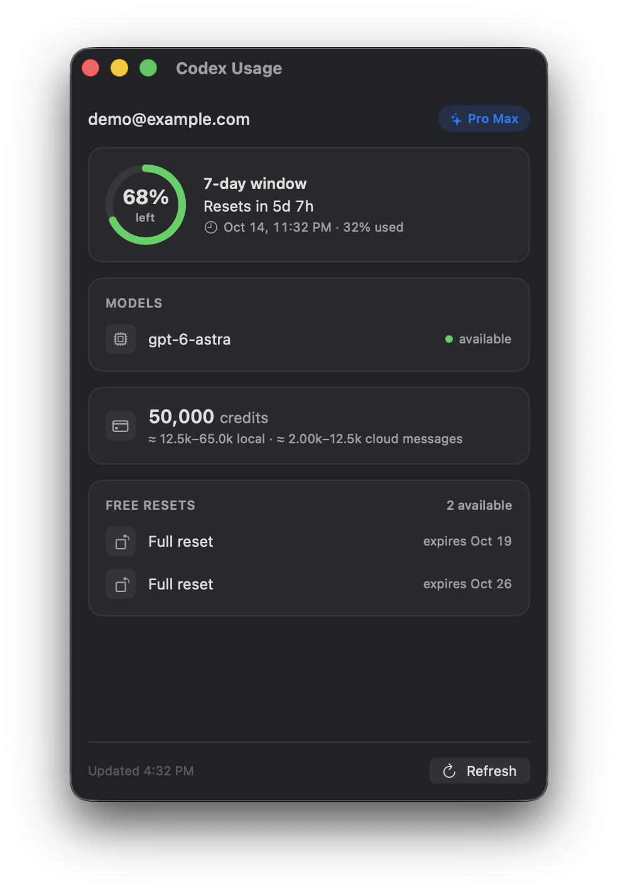

# Codex Usage

A small macOS window that shows your ChatGPT/Codex account usage.



## What it shows

- Your primary rate limit window (5-hour or 7-day) as a remaining percentage, with the reset time. Secondary windows appear below it when present.
- Model availability for models with a special state (gated, new, or credit-enabled).
- Your credit balance and the approximate message count it covers.
- Free rate limit resets you hold, with expiry dates.
- Your individual spend limit, if one is set on the account.

The window refreshes automatically every 60 seconds, and on demand with the Refresh button or `⌘R`.

## Requirements

- macOS 14 or later
- A Codex CLI login: `~/.codex/auth.json` with a ChatGPT account (`codex login`). API key auth via `OPENAI_API_KEY` and personal access tokens also work.

## Install

```sh
make install
```

This builds the release app and copies it to `~/Applications/CodexUsage.app`.

Other targets:

| Command | What it does |
| --- | --- |
| `make app` | Release build to `./CodexUsage.app` |
| `make run` | Debug run from source |
| `make icon` | Regenerate `Resources/AppIcon.icns` |
| `CodexUsage.app/Contents/MacOS/CodexUsage --dump` | Print your usage to the terminal, no window |

## Behavior

- Read-only, except token refresh. When the access token is within 5 minutes of expiry, the auth file is older than 8 days, or a usage call returns 401, the app rotates the refresh token the way the CLI does and writes it back into `auth.json`. All usage calls are plain `GET`s against your own account.
- The window remembers its position and size. Quit the app, then run `defaults delete dev.spmurray.codex-usage` to reset the frame.
